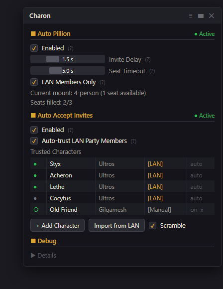
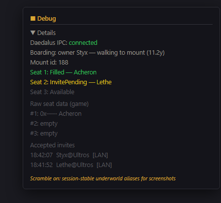

<p align="center">
  
</p>

# Charon

**The ferryman for your fleet.** A Dalamud plugin for FFXIV, companion to [Daedalus](https://github.com/ofnature/Daedalus) — party assembly, auto pillion with smart seat scanning, whitelisted auto group invite, follow teleport, a heal-watch babysitter for leveling alts, and FC chest management.

Built for multibox setups: invite the fleet, group up, mount up, teleport out, keep the bots alive, and manage the FC chest — without touching seven other keyboards.

<p align="center">
  
</p>

## Auto Pillion

Existing auto-pillion tools default everyone to seat 2 and spam it when taken. Charon scans real seat occupancy and assigns intelligently:

- **Passengers board themselves** — each client detects a trusted party member mounting a multi-seat mount nearby, deterministically computes its own seat (rank-by-name over the toons actually present, k-th toon takes the k-th free seat), and boards through the game's native Ride Pillion call. No seat collisions, works with zero messaging.
- **Owner-commanded seats over the LAN** — with the Daedalus LAN relay running, the mount owner broadcasts authoritative seat assignments (cross-machine included); observation-based self-boarding remains the always-working fallback.
- **Walks to the mount first** via [vnavmesh](https://github.com/awgil/ffxiv_navmesh) when out of range (optional — works without it if the toons already stand nearby).
- Party-gated (a game rule), configurable invite delay and seat timeout, live rider list in the window.

## Group Management

Assemble the whole fleet from the Daedalus LAN roster:

- **Mass Invite All** — one button invites every online LAN toon not already in your group, staggered to dodge rate limiting and capped at the 8-slot party. Your alts' auto-accept does the rest.
- Per-toon **Invite** buttons with live **In Group** / **Offline** / **Party full** states and a running group count.
- Uses the game's native invite call (content id + world), so multi-word and cross-world (same DC) names both work.

## Auto Accept Group Invites

Accepting invites on 7 toons manually gets old. Charon auto-accepts **from trusted characters only**:

- Manual whitelist (name + world, case-insensitive) with per-entry enable/disable, plus optional auto-trust for everyone in the Daedalus LAN party roster (one-click import too).
- Strangers are **ignored, never declined** — the dialog stays up for you to decide.
- Small randomized accept delay; invite detection is language-independent (no dialog text parsing).

## Follow Teleport

When a trusted party member teleports, the rest of the group follows:

- Auto-accepts the native party teleport offer ("Accept Teleport to X?") — the dialog is learned automatically the first time it appears.
- Fallback: when a trusted member zones away without an offer, teleport to an attuned aetheryte in their new zone.
- Same group only, small randomized delay per toon.

## Heal Watch

A healer toon babysits the whole fleet from Daedalus LAN vitals — **including toons outside its party**. Built for leveling low-HP alts (looking at you, 9k-HP Blue Mages):

<p align="center">
  
</p>

- Heals anyone dropping below the threshold; an emergency threshold jumps the queue.
- **Maintains the job's HoT/shield** (WHM Regen, SCH Galvanize, AST Aspected Benefic) on damaged toons — never clips a running status, recasts only inside the expiry window.
- **Hardcast raises** dead toons (no swiftcast needed), and never double-raises anyone with a raise already pending.
- Live HP is re-checked before every cast (LAN vitals are detection only), and Heal Watch stands down automatically whenever the Daedalus rotation is enabled.

## FC Chest Management

Consolidate and reclaim the Free Company chest, per page:

- A dedicated window **pops up automatically next to the game's FC chest** with a per-page contents table (item / quantity / stacks) for pages 1–5.
- **Entrust Duplicates** — sends every inventory stack of items already on the page, merging into existing stacks instead of scattering into free slots.
- **Withdraw all but 1** per item — leaves exactly one unit behind as the seed and pulls the rest to your bags.
- Manual trigger only, confirm before entrusting, gated on the chest being open with the page loaded; every move is verified against real chest state before the next one fires.

## Daedalus Integration

When [Daedalus](https://github.com/ofnature/Daedalus) is loaded, Charon consumes its LAN party roster + vitals over IPC and its LAN relay for cross-machine coordination — reconnects survive plugin reloads, and everything degrades gracefully to the manual whitelist when Daedalus is absent.

Bonus for screenshots: a **Scramble** toggle swaps every character name for a session-stable underworld alias (Styx, Acheron, Lethe…) — cosmetic and draw-time only.

## Installation

Add the repo URL to Dalamud (Settings → Experimental → Custom Plugin Repositories):

```
https://raw.githubusercontent.com/ofnature/Daedalus/main/repo.json
```

Then install **Charon** from the plugin installer. `/charon` toggles the window.

One URL, whole family: the same repository also serves [Daedalus](https://github.com/ofnature/Daedalus) and [SealBreaker](https://github.com/ofnature/SealBreaker).

## Building

```
dotnet build Charon.sln -c Release
dotnet test Charon.Tests
```

Targets `Dalamud.NET.Sdk/15.0.0`; the test suite covers the seat state machine, deterministic seat picking, relay seat commands, whitelist matching, heal-watch triage, mass-invite eligibility, FC chest planning, and IPC fallback.

*Window images above are stylized mockups of the in-game UI (names scrambled).*
