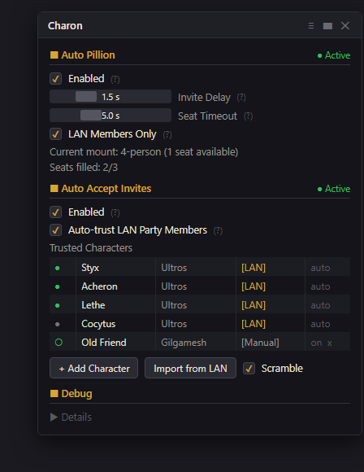
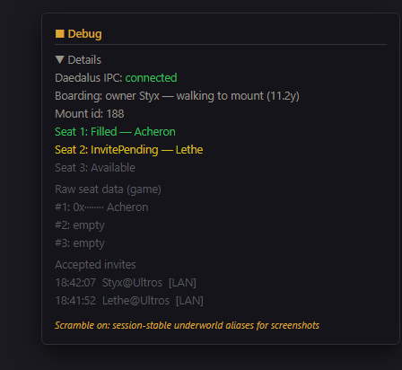
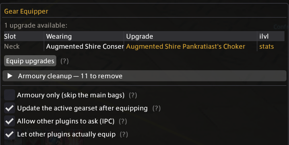

<p align="center">
  
</p>

# Charon

**The ferryman for your fleet.** A Dalamud plugin for FFXIV, companion to [Daedalus](https://github.com/ofnature/Daedalus) — party assembly, auto pillion with smart seat scanning, whitelisted auto group invite, follow teleport, fleet follow, duty-pop and trade automation, a heal-watch babysitter for leveling alts, automatic gear upgrades, fleet-leader commands, collectible sweeping, FC chest management, gil-cap selling and Doman Enclave donations.

Built for multibox setups: invite the fleet, group up, mount up, teleport out, follow you around, keep the bots alive, and manage the FC chest — without touching seven other keyboards.

<p align="center">
  
</p>

## Auto Pillion

Existing auto-pillion tools default everyone to seat 2 and spam it when taken. Charon scans real seat occupancy and assigns intelligently:

- **Passengers board themselves** — each client detects a trusted party member mounting a multi-seat mount nearby, deterministically computes its own seat (rank-by-name over the toons actually present, k-th toon takes the k-th free seat), and boards through the game's native Ride Pillion call. No seat collisions, works with zero messaging.
- **Owner-commanded seats over the LAN** — with the Daedalus LAN relay running, the mount owner broadcasts authoritative seat assignments (cross-machine included); observation-based self-boarding remains the always-working fallback.
- **Walks to the mount first** via [vnavmesh](https://github.com/awgil/ffxiv_navmesh) when out of range (optional — works without it if the toons already stand nearby).
- **Tells you when it's full** — a notification pops on the driver's screen once every passenger seat is taken, so you can ride off without counting riders.
- Party-gated (a game rule), configurable invite delay and seat timeout, live rider list in the window.

## Group Management

Assemble the whole fleet from the Daedalus LAN roster:

- **Mass Invite All** — one button invites every online LAN toon not already in your group, staggered to dodge rate limiting and capped at the 8-slot party. Your alts' auto-accept does the rest.
- Per-toon **Invite** buttons with live **In Group** / **Offline** / **Party full** states and a running group count.
- Uses the game's native invite call (content id + world), so multi-word and cross-world (same DC) names both work.

## Auto Accept Group Invites

Accepting invites on 7 toons manually gets old. Charon auto-accepts **from trusted characters only**:

- Manual whitelist (name + world, case-insensitive) with per-entry enable/disable, plus optional auto-trust for everyone in the Daedalus LAN party roster (one-click import too).
- Strangers are **ignored, never declined** — the dialog stays up for you to decide.
- Small randomized accept delay; invite detection is language-independent (no dialog text parsing).

## Follow Teleport

When a trusted party member teleports, the rest of the group follows:

- Auto-accepts the native party teleport offer ("Accept Teleport to X?") — the dialog is learned automatically the first time it appears.
- Fallback: when a trusted member zones away without an offer, teleport to an attuned aetheryte in their new zone.
- Same group only, small randomized delay per toon.

## Duty Pops & Trades

Two more clicks the fleet shouldn't need — both gated on trusted LAN toons only:

- **Auto-commence duty pops** — clicks Commence on the Duty Ready window, but *only* when every other party member is a trusted LAN toon (your fleet queueing together). A solo/roulette pop, or any stranger in the party, is always left to you. Withdraw is never clicked.
- **Mirror LAN toon trades** — when a fleet toon clicks Trade, the other toon clicks Trade and answers "Complete trade?". It only ever mirrors *after* the partner commits, never commits first, and never cancels. The partner is read from the trade window itself, so a trade with anyone outside the fleet is left completely alone.

## Fleet Follow

BossMod-Reborn-style follow, commanded across the fleet: from your main, tell every LAN toon to follow you around the overworld and through dungeons.

- **Follow Me (All)** or per-toon Follow/Stop — the commanded toons trail you via [vnavmesh](https://github.com/awgil/ffxiv_navmesh), pathing around walls and terrain.
- **Flex leash in combat:** a tight follow drags a melee toon off its target — it spends the fight running instead of attacking. In ordinary combat the follower holds position until you get past the leash (15y by default), then closes right back up. Adjustable, and boss fights are unaffected since those hand movement to BMR entirely.
- **Clean boss handoff:** follow keeps going into the arena and through pre-pull, then hard-stops the instant a boss fight engages (in combat **and** a BossMod module loaded) so BMR's AI owns movement — and resumes automatically when the fight ends. Normal trash combat never breaks the convoy.
- **Takes your portal:** step through a raid portal stone, a lift or a spatial rift and your followers take the same one. Your client *announces* the transition over the LAN — the spot you left and which object was there — so followers click the thing you actually used instead of inferring from where you went. That matters for rifts, which remove you from the other clients entirely, and for anything that drops you somewhere still walkable, where nothing looks wrong to infer from in the first place.
- **Holds instead of guessing:** if a leader ends up somewhere genuinely unwalkable and nothing was announced, followers hold with a clear status rather than running at a wall, and resume the moment you're reachable again. A leader vanishing from right beside you counts as a transition; one who simply walked out of range doesn't.
- **See who's following whom** — the LAN party table shows each toon's current leader, reported by that toon's own client. A box that's gone quiet shows as unknown rather than a stale answer.
- **Sprints to keep up:** out of combat, a moving toon sprints automatically, so followers don't trail you at a walk. Never in combat, never while mounted, and never while standing still.
- Pairs with Follow Teleport (zone away and the alts teleport to you, then follow resumes) and yields cleanly to auto-pillion when you mount up. `/charon follow <name>` drives one box directly.

## Fleet Leader

Designate one toon as fleet leader and give it fleet-wide commands:

- **Set it once.** Picking the leader broadcasts the choice to every Charon on the LAN, so you don't set the same name on eight clients. Either driven toon can be the leader.
- **Leave Duty (My Party)** — the leader pulls its own party out of the duty in one click. Fleet toons in a *different* group, off running their own dungeon, are unaffected, and a party holding anyone outside the fleet stays put. Confirms first.
- **Leadership hand-back** — a disconnect moves party leadership to another member (usually a bot) and it never comes back on its own. Whichever toon inherited it hands it back once the leader is online again *and in the same zone* (the game refuses the transfer otherwise).
- Only the designated leader is obeyed, so a stray click on an alt can't drag the fleet anywhere. Per-toon opt-outs for both behaviours.

## Heal Watch

A healer toon babysits the whole fleet from Daedalus LAN vitals — **including toons outside its party**. Built for leveling low-HP alts (looking at you, 9k-HP Blue Mages):

<p align="center">
  
</p>

- Heals anyone dropping below the threshold; an emergency threshold jumps the queue.
- **Maintains the job's HoT/shield** (WHM Regen, SCH Galvanize, AST Aspected Benefic) on damaged toons — never clips a running status, recasts only inside the expiry window.
- **Hardcast raises** dead toons (no swiftcast needed), and never double-raises anyone with a raise already pending.
- **Accepts the revival** on the raised toon. Unattended characters have nobody to click the prompt, so without this the raise resolves and the bot stays on the floor. Only ever fires while dead with a raise incoming — it never guesses at other dialogs.
- Live HP is re-checked before every cast (LAN vitals are detection only), and Heal Watch stands down automatically whenever the Daedalus rotation is enabled.

## FC Chest Management

Consolidate and reclaim the Free Company chest, per page:

- A dedicated window **pops up automatically next to the game's FC chest** with a per-page contents table (item / quantity / stacks) for pages 1–5.
- **Entrust Duplicates** — sends every inventory stack of items already on the page, merging into existing stacks instead of scattering into free slots.
- **Withdraw all but 1** per item — leaves exactly one unit behind as the seed and pulls the rest to your bags.
- Manual trigger only, confirm before entrusting, gated on the chest being open with the page loaded; every move is verified against real chest state before the next one fires.
- **Text Size** slider (100–250%) for the item list — scales the whole panel proportionally, persisted per install.

## Gear Equipper

Leveling alts wear whatever dropped three dungeons ago. Charon finds the upgrades and puts them on:

<p align="center">
  
</p>

- **Scans bags *and* armoury** — dungeon and [SealBreaker](https://github.com/ofnature/SealBreaker) loot lands in your main inventory, so that's where it looks first (armoury-only is an opt-in checkbox). Filters by job, equip level, and slot; handles the ring pair and unique-equip rings, and skips the offhand when you're wielding a two-hander. **Gathering and crafting gear is never equipped on a combat job** — much of it sits in the "All Classes" category, so the game will happily let a Paladin wear a ring statted for Perception, and its item level would otherwise win. **Race-locked gear is skipped too** — starting pieces like the Roegadyn Bodice read as "All Classes" at level 1 but only one race and sex can actually wear them.
- **Item level first, then stats — and it still works at cap.** A higher item level always wins. At the *same* item level it compares a job-weighted stat score (main stat, crit/determination/direct hit, tenacity for tanks, piety for healers) and swaps when the spread is clearly better, so a max-level toon whose gear is all one item level keeps improving instead of going dead. A **lower** item level never wins, however good the stats — item level gates duty entry.
- **Bags → armoury → equip:** an upgrade sitting in a bag moves into the armoury *first*, then gets equipped from there — so the piece it replaces swaps into the armoury and your bags stay clear for loot.
- **Preview first.** The window always shows exactly what would change (slot, what you're wearing, what replaces it, ilvl gained) with a manual Equip button. Every step is re-planned against live inventory and verified before the next one fires — never a replayed batch. If one piece refuses to equip it's set aside and the rest still go on, with the skip reported.
- **Clean armoury** — lists every armoury item that no saved gearset uses, then moves them back to your bags on one button. Each row has a **Keep** tick to protect that item permanently (glamour pieces, spare weapons), and a separate **Protected from cleanup** list shows everything you've protected — including items not currently in the armoury — so a stray tick is always visible and undoable. Moving items asks for confirmation first, and warns when you don't have the bag space for the whole sweep. **EXP-bonus gear is protected out of the box** — Brand-new Ring, Friendship Circlet, the pre-order earrings (Ala Mhigan / Aetheryte / Menphina's / Azeyma's) and friends are tagged `[EXP]` and pre-ticked, since they belong to no gearset and several can never be re-obtained. Gearset gear is never touched, soul crystals always stay put, and if your gearsets haven't loaded yet nothing is evicted at all.
- **Fleet-wide over IPC:** SealBreaker asks Charon to gear up after a duty and *before* Expert Delivery, so drops get worn instead of turned in. Callers that can't reach Charon fall back to the game's Equip Recommended, so nothing breaks when it isn't installed. There's a switch to decline plugin requests (preview only) if you'd rather drive it by hand.
- Never runs in combat, in a duty, mid-cast, or while zoning.

## Loot Rolls (preview)

Charon works out Need / Greed / Pass for everything on the loot window and **shows you what it would do** — it doesn't roll yet. Rolling arrives once the decisions have been checked against real drops.

- **Ordered rules, first match wins.** Read down the list and the first matching row is the answer, rather than a pile of independent toggles whose combined effect nobody can predict.
- **Nothing to switch on and off.** The rules are written to be right in every situation: an unowned collectible is always worth Need, gear your job can't wear is always a Pass. There's no per-run state to forget.
- **Polite by default.** Need is downgraded to Greed whenever anyone outside your fleet is in the party.
- **Knows what a duplicate is worth.** An already-unlocked collectible is Greed on an account that can sell it and Pass on a free trial one, decided automatically.
- **Every decision says why**, down to which gate refused a piece of gear — wrong job, wrong stats, race-locked, or simply too low a level. Four very different reasons that a single "can't wear it" line would have hidden.
- Gear decisions share the Gear Equipper's rules, so loot and equipping can never disagree about what's wearable.

## Collect

Quest rewards, trust runs and AutoDuty runs hand you items directly — no loot roll involved — so an unattended toon quietly accumulates unlearned minions, mounts and orchestrion rolls for weeks.

- **Lists what you're holding but haven't learned**, with a Collect button on each row. Nothing is ever consumed without a click.
- **Only real one-time unlocks are offered.** The game reports an ordinary potion as "not unlocked" exactly like a genuinely unlearned collectible, so Charon works from a verified allowlist: minions, mounts, emotes and hairstyles, orchestrion rolls, fashion accessories, facewear, chocobo barding, Triple Triad cards, Occult Record notes and phantom job soul shards. Anything it doesn't recognise is logged rather than offered, which is how the list grows — from observed values, never guesses.
- **Booster packs are not cards.** The seven Triad Card packs open into random cards, so "already collected" isn't a question you can ask of one — they're excluded, while the individual cards they contain are listed.
- **Duplicates never appear.** The game won't relearn something you own, so a spare mount stays sellable by construction. Fashion accessories and chocobo barding are the kinds where an *unlearned* item can still be worth real gil — which is safe only because Collect is a deliberate per-item click.
- **Phantom job shards are zone-aware** — listed anywhere so you can see you have one, but only collectable in the Occult Crescent where they actually work.

## Gil Tools

Two money errands for unattended toons, under the GIL section:

- **FT Gil Capping** — free trial accounts cap at 300,000 gil, so a stockpile of GC-bought Duck Bones is how a bot stays solvent. One button splits the exact quantity needed (one bone *over* the cap rather than one short — passing it just prints a chat line), walks to the nearest gil vendor via vnavmesh, opens the shop and sells. Vendors are found by data — any NPC carrying a gil-shop handler — not from a hand-kept list.
- **Doman Donate** — the Enclave's donation basket pays a gratuity (vendor value × rate) up to a weekly budget that varies by reconstruction stage, and **anything over the budget is eaten**. Charon reads the live budget and rate, splits exactly enough to meet it by the smallest possible margin, stages the stack, presses Donate and answers the confirmation. It refuses to stage any stack larger than the target — that rail exists because a stale number once donated a 999-pile for a fraction of its value.
- **Knows when you're done for the week.** The client's own Doman state (the same source as the Timers window) says whether this character can still donate — readable anywhere, no trip to find an empty basket. Resets Tuesday.

## Leveling Support (IPC)

Groundwork for SealBreaker's leveling mode: `Charon.Leveling.*` gates expose every combat job's level and unlock state (one entry per exp *track* — a class and its job share one), each carrying its own blocker ("below 15 — run class hunts", "run the class quest", "needs Endwalker — not available on this account") so a round-robin leveler always knows *why* a job was skipped. Plus job switching via gearsets with a verified completion event, and the gil commands above. The account's level cap is derived live from its expansion ceiling, so a free trial reads 80 today and follows automatically if the trial ever grows.

## Daedalus Integration

When [Daedalus](https://github.com/ofnature/Daedalus) is loaded, Charon consumes its LAN party roster + vitals over IPC and its LAN relay for cross-machine coordination — reconnects survive plugin reloads, and everything degrades gracefully to the manual whitelist when Daedalus is absent.

Bonus for screenshots: a **Scramble** toggle swaps every character name for a session-stable underworld alias (Styx, Acheron, Lethe…) — cosmetic and draw-time only.

## Installation

Add the repo URL to Dalamud (Settings → Experimental → Custom Plugin Repositories):

```
https://raw.githubusercontent.com/ofnature/Daedalus/main/repo.json
```

Then install **Charon** from the plugin installer. `/charon` toggles the window — or `/cha` for short.

One URL, whole family: the same repository also serves [Daedalus](https://github.com/ofnature/Daedalus) and [SealBreaker](https://github.com/ofnature/SealBreaker).

## Building

```
dotnet build Charon.sln -c Release
dotnet test Charon.Tests
```

Targets `Dalamud.NET.Sdk/15.0.0`; the test suite covers the seat state machine, deterministic seat picking, relay seat commands, whitelist matching, heal-watch triage, mass-invite eligibility, FC chest planning, follow gating, and IPC fallback.

*Window images above are stylized mockups of the in-game UI (names scrambled).*
